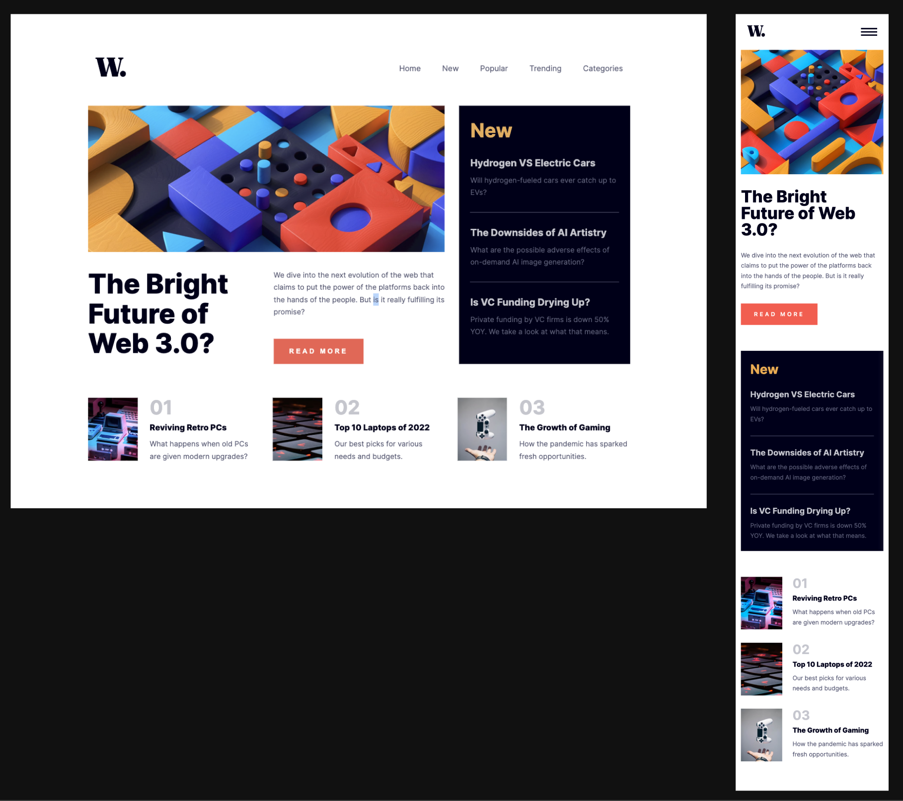

# Frontend Mentor - News homepage

This is my solution to the News homepage

## Table of contents

- [Overview](#overview)
  - [Screenshot](#screenshot)
  - [Links](#links)
- [My process](#my-process)
  - [Built with](#built-with)
  - [What I learned](#what-i-learned)
  - [Continued development](#continued-development)
- [Author](#author)

## Overview

- View the optimal layout for the interface depending on their device's screen size
- See hover and focus states for all interactive elements on the page
- Toggle the mobile menu. It appears from the right side of the screen

### Screenshot

#### Desktop and mobile versions of layout

### Links

- Live Site URL: https://news-homepage-nadiafr.netlify.app/

## My process

### Built with

- Semantic HTML5 markup
- SASS architecture (sass variables, @mixins ..)
- Flexbox
- Grid
- Animation in css

### What I learned

- SASS architecture for a project with simple grid system.
- Use breakpoint mixins and SASS map to apply screen width

### Continued development

Responsive layout using SASS.

## Author

Nadia Furzikova - front-end developer,
based 📍 Nancy/France
